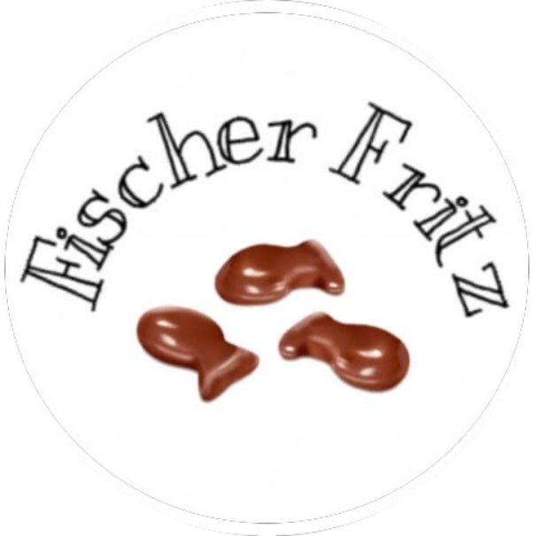
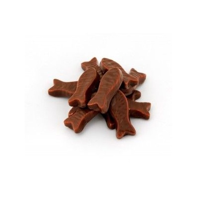
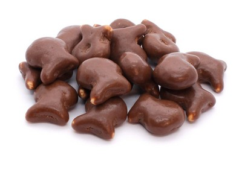
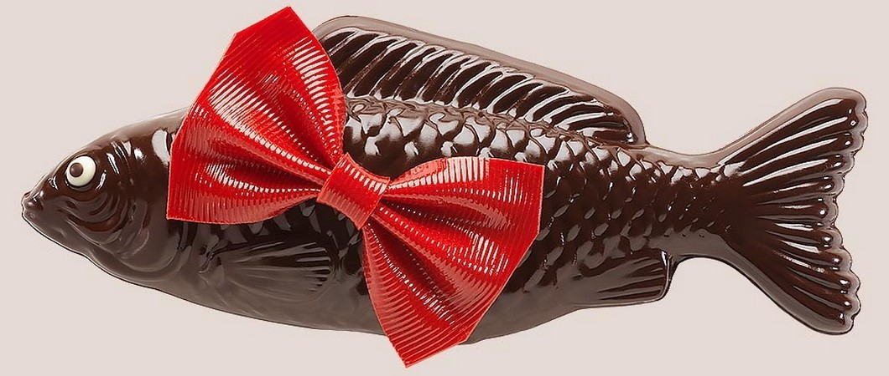

<!DOCTYPE HTML>
<html lang="ru">
  <head>
    <meta charset="utf-8">
    <title>Fischer Fritz</title>
    <link rel="stylesheet" href="7.css">
  </head>
  <body>
    

      

        

          

            
          

          <ul class="main-nav clearfix">
            <li><a href="#">über uns</a></li>
            <li><a href="#">Katalog</a></li>
            <li><a href="#">Bewertungen</a></li>
          </ul>
          <a class="btn btn-quick-order" href="#">bestellen</a>
        

        

          <a href="#">Katzen-leckereien  Fischer Fritz</a>
        

      

    

    

      

        <ul class="clearfix">
          <li class="feature-item feature-choice">
            <h2 class="feature-title">Auswahl</h2>
            
Ihr Haustier wird die Breite unserer Auswahl an leckereien zu schätzen wissen.

          </li>
          <li class="feature-item feature-quality">
            <h2 class="feature-title">Qualität</h2>
            
Unsere waren tragen keinen Schaden für Ihre Katzen.

          </li>
          <li class="feature-item feature-safety">
            <h2 class="feature-title">Sicherheit</h2>
            
Alles wird aus natürlichen Inhaltsstoffen hergestellt, die für Katzen sicher sind.

          </li>
        </ul>
      

    

    

      

        <h2 class="section-title">Ein wenig über uns</h2>
        <a class="btn to-full-reference" href="#" title=" über uns öffnen"> über uns</a>
        <dl>
          

            <dt class="reference-title">
              unsere Fabrik
            </dt>
            <dd>
              
              

              
              
              

            </dd>
          

          

            <dt class="reference-title">
            </dt>
            <dd> 
            </dd>
          

        </dl>
      

    

    

      

        <h2 class="section-title">Zufriedene Katzen</h2>
        <a class="btn to-all-reviews" href="#" title="Alle Bewertungen anzeigen">Alle Bewertungen</a>
        

          <blockquote class="review-item">
            
Vielen Dank für die lange anfallende Idee! Mit Huhn, mit Fisch, mit Wiener Würstchen B-)

            <cite class="review-author">Barsik, st. Berlin</cite>
          </blockquote>
          <blockquote class="review-item">
            
Ich kann einfach nicht ohne Süßigkeiten und jetzt nicht brauchen, um die Gastgeberin in den laden zu ziehen, bestelle alles auf Ihrer Website Online!

            <cite class="review-author">Murka, st. Bonn</cite>
          </blockquote>
        

      

    

    

      

        <h2 class="section-title">Bestseller</h2>
        <a class="btn to-catalog" href="#" title="Katalog">Katalog</a>
        

          

            
            <h3>Fische «Classic», mit Fisch</h3>
            <b class="catalog-item-price">3 Eu /100 Gr</b>
            <a class="btn btn-info" href="#">Beschreibung</a>
            <a class="btn btn-buy" href="#">kaufen</a>
          

          

            
            <h3>Fisch mit saftigem Fleisch</h3>
            <b class="catalog-item-price">4 Eu /100 Gr</b>
            <a class="btn btn-info" href="#">Beschreibung</a>
            <a class="btn btn-buy" href="#">kaufen</a>
          

          

            
            <h3>Fisch mit Wiener Brustwarzen</h3>
            <b class="catalog-item-price">5 Eu /100 Gr</b>
            <a class="btn btn-info" href="#">Beschreibung</a>
            <a class="btn btn-buy" href="#">kaufen</a>
          

        

        
      

    

    

      

        <h2 class="section-title">Noch Fragen?</h2>
        
Kontaktieren Sie uns und wir werden Ihre verbleibenden Zweifel zerstreuen!

        <form class="feedback-form" action="/keksby-mail" method="post">
          

            <label for="fullname">Stellen Sie sich bitte vor:</label>
            <input type="text" name="fullname" id="fullname">
          

          

            

              <label for="phone">Telefonnummer:</label>
              <input type="text" name="phone" id="phone">
            

            

              <label for="email">E-Mail:</label>
              <input type="text" name="email" id="email">
            

          

          

            <label>
              <input type="checkbox" name="subscription">
              Ich Stimme zu, Spam und SMS am Telefon zu erhalten
            </label>
          

          

            <label for="topic">Thema der Behandlung:</label>
            <select name="topic" id="topic">
              <option value="1">Lieferbedingungen</option>
              <option value="2">Retoursendung</option>
              <option value="3">Beschwerde bei Rospotrebnadzor</option>
            </select>
          

          

            <label for="message">Text der Anfrage:</label>
            <textarea name="message" id="message"></textarea>
          

          <input class="btn" type="submit" value="Senden">
        </form>
      

    

    

      

        

          

            
          

          <a class="btn btn-quick-order" href="#">Bestellen</a>
        

        

        

          

            
            
          

        

      

    

  </body>
</html>
